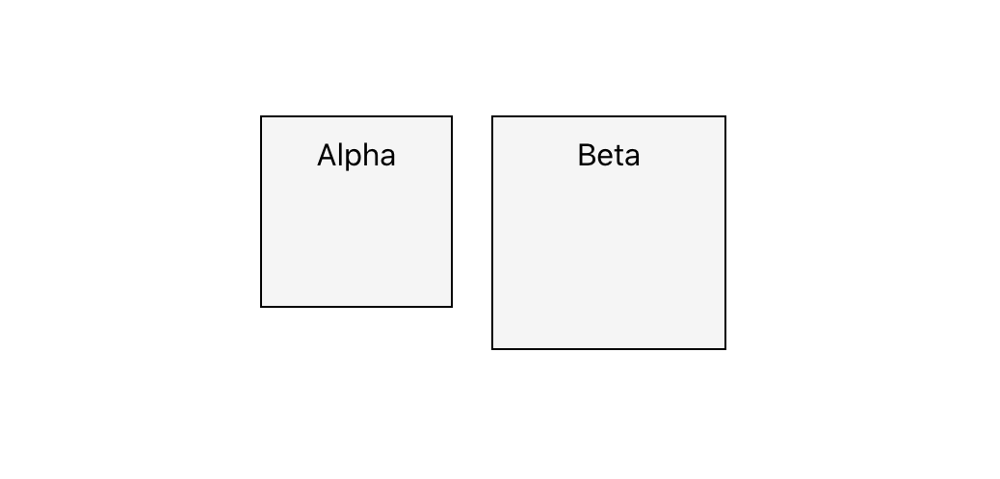
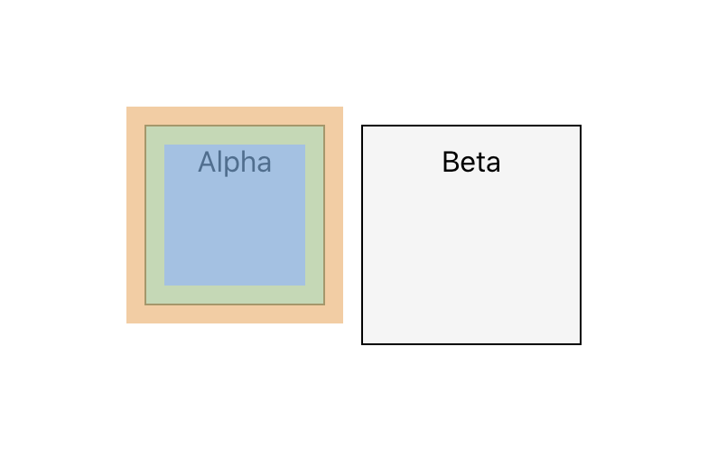
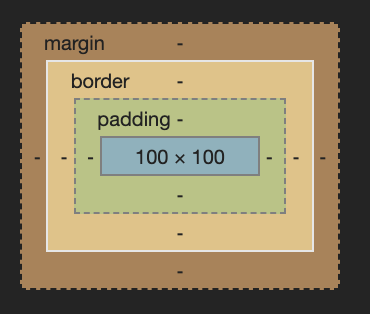
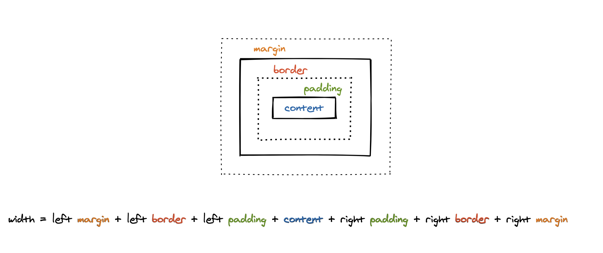
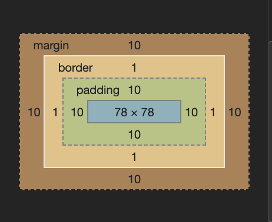
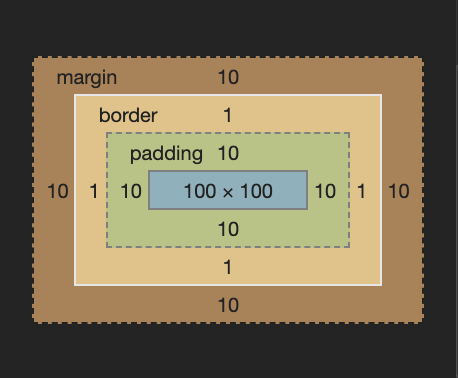
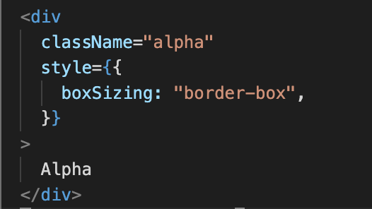
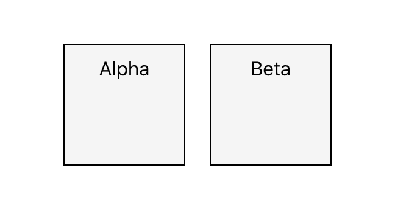

```
* Log: 31st August 2020
* Topic: box-sizing, z-index, position properties
* Tag: CSS
```

# The Box-sizing Property

Let me tell you a story about a Beta who wished to be an Alpha. Beta was 'beta' because he had a problem, the problem was about him not paying attention to details. One day he decided to meet Alpha and study his structure.



On meeting alpha, he pulled out his inspect tool.



On reading Alpha's properties he was shocked by the fact that Alpha had the same properties as his.

```
.alpha {
  width: 100px;
  height: 100px;
  display: inline-block;
  background-color: whitesmoke;
  padding: 10px;
  margin: 10px;
  border: 1px solid;
}
```

```
.beta {
  width: 100px;
  height: 100px;
  display: inline-block;
  background-color: whitesmoke;
  padding: 10px;
  margin: 10px;
  border: 1px solid;
}
```

Amazed by what he had just discovered he asked Alpha,
**Beta:** _"So what makes you different: I have the same width, height, padding, margin & border, yet you appear different in size and structure, how's that possible ?"_

**Alpha:** _"Are you aware of the reality of Box model"._
**Beta:** _"Nope! Never heard of it"_

Let me show you:

## Box Model

The box model is the basic building block of CSS. Every element in web design is a rectangular box.

Let's look at the structure of the box model: (From top to bottom, order wise)

- Margin
- Border
- Padding
- Content (height and width),

These are all the elements the browser needs in order to render a box model.
With CSS you can control each of them individually.



1. **Margin:**
   Creates space around elements, it is the space outside of any defined borders.
2. **Border:**
   The border surrounds the content, and you don’t have to use it, but it still exists. By default, border has a width of 0px.
3. **Padding:**
   Padding defines the space between the content and the edge of the box.
4. **Content:**
   It represents the actual stuff, text, image, etc. and has a specific width and height.
   Fixed height and width can be set using the height and width of CSS properties, or they can be determined by the content itself.

Read about `inline vs inline-block` to further understand this line: `determined by the content itself` here: https://github.com/hamza-ghufran/journal/blob/master/content:posts/2020-08-22/index.md

**Alpha:** _"Beta, Do you know what defines the width of an element ?"_

**Beta:** _" I am listening"_

There is a formula for defining this:

```
width = left margin + left border + left padding + content + right padding + right border + right margin
```



**Alpha:** _"Take out your inspect tool and let's compare our structure properties."_




Alpha's and Beta's box models respectively.

**Alpha:** _"Now do you see it?"_

**Beta:** _" I am not sure"_

Even though your width & height is set to 100px, the actual width & height will be much different.
Going back to our formula:

```
Beta's dimensions:
width & height = 10px + 1px + 10px + 100px + 10px + 1px + 10px => 142px
```

```
Alpha's dimensions:
width & height = 10px + 1px + 10px + 78px + 10px + 1px + 10px => 120px
```

**Alpha:** _"So Beta, while structuring myself I have taken into account the following properties: border, padding, and margin"_

**Alpha:** _"Now probably you are thinking about having to use the calculator every time while structuring yourself, well you can but there is another solution to that or you can say the right way to deal with the problem"_

An important property that’s connected to the box model is the box-sizing property.

The box-sizing property defines how the height and width of the element are calculated and if it should include the border and padding.

By default each element has `box-sizing: content-box`

## The evolution of Beta

Alpha lifts the curtain:



**Beta:** _"What the hell! Is that it, let me add that"_

```
.beta {
    width: 100px;
    height: 100px;
    display: inline-block;
    background-color: whitesmoke;
    padding: 10px;
    margin: 10px;
    border: 1px solid;
    /* The secret to becoming Alpha*/
    box-sizing: border-box;
}
```



## Purpose

 *It is often useful to set box-sizing to border-box to layout elements. This makes dealing with the sizes of elements much easier, and generally eliminates a number of pitfalls you can stumble on while laying out your content.*

 *Applying box-sizing: border-box to an element changes the box model to a more predictable behavior. Setting height or width will control the size of the entire element, including its padding and border.*

 *If you have ever been creating a page layout for the web and found yourself doing all kinds of math to figure out how wide or tall you can make things and have them behave properly on the page, then you have encountered what it means to deal with the box model. It is important to understand how margins, borders, padding, and content all work together to create the layout of elements on the page.*

 # The Z-Index Property
